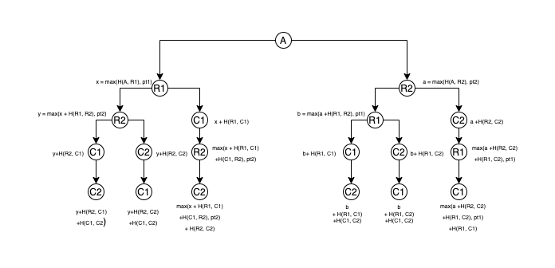
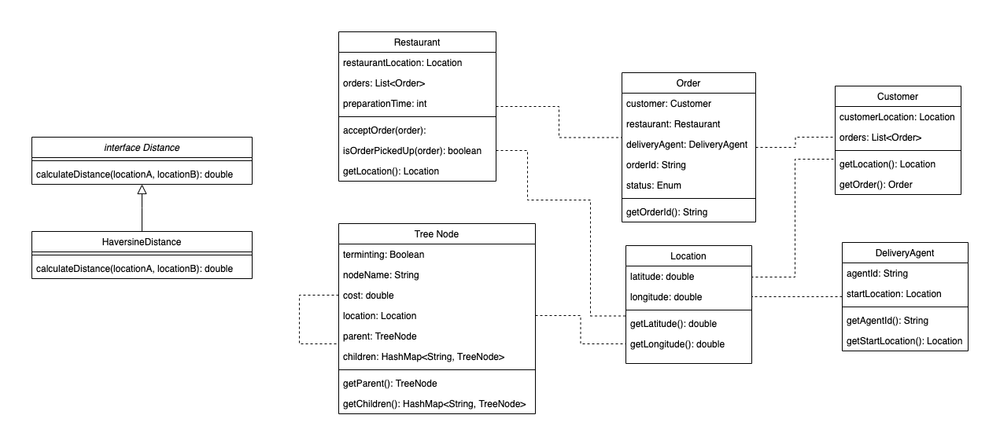

# Best Route

## Problem Statement
Find optimized route for a delivery agent to deliver food to customers from restaurants.

## Solution Approach

The following solution solves the problem for n customers/restaurants  
Assumptions: 
- number of delivery agent = 1  
- each customer Ci has ordered from restaurant Ri  

Let number of customers/restaurants = n  
Find out all possible paths that the delivery agent (A) can take.  
Total number of paths = (2n)! since starting point is always A.  
Observation: Delivery agent has to visit restaurant Ri before delivering to customer Ci. Hence valid paths would be a subset of all paths.  
Once we get all valid paths, we ingest them into a n-ary tree data structure. A TreeNode can be agent A or customer C or restaurant R.
```
public class TreeNode {
    boolean terminating;                      // true, if leaf node
    String nodeName;
    double cost;                              // cost of reaching the node
    Location location;
    TreeNode parent;
    HashMap<String, TreeNode> children;
}
```
Cost calculation for a node:
- if node = A (agent), cost = 0, since it is always the starting point  
- if node = C (customer), cost = cost(parent) + HaversineDistance(parent, node)
- if node = R (restaurant), cost = max(cost(parent) + HaversineDistance(parent, node), preparation_time)  

While adding each path in the tree, we add the leaf node to a list and finally find out the minimum cost amongst those and hence the minimum path.  

### Example
The diagram below shows all valid paths with costs for n = 2  

  

In this case, there are only 6 valid paths which A can take. The data structure stores all these paths and cost of each leaf node is the cost for that path.

### Class Diagram  


### Further Optimizations
- We can prune the tree if at any node in a path the cost is greater than current global minimum cost.  
